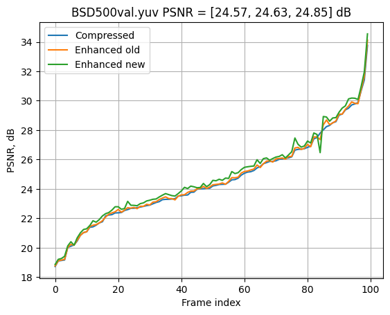
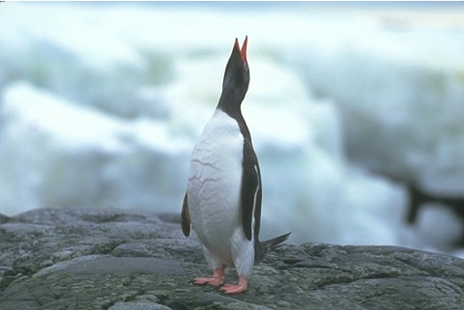
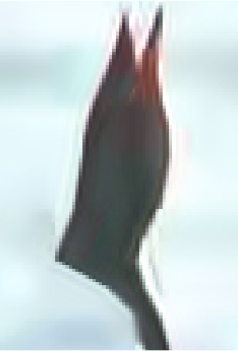
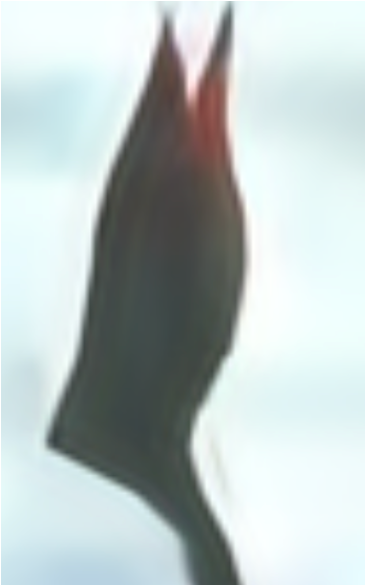
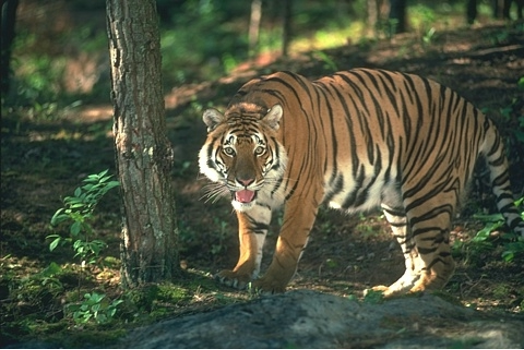
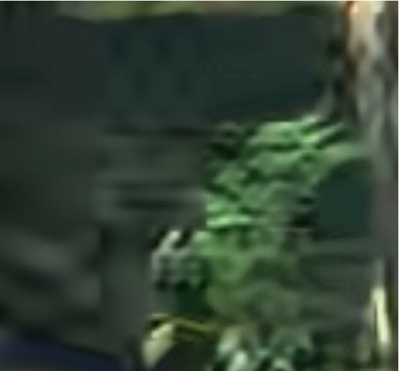
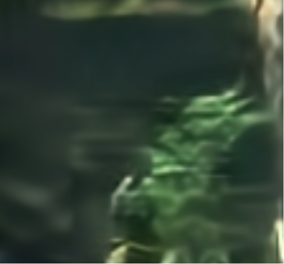
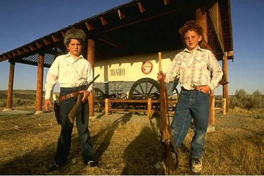
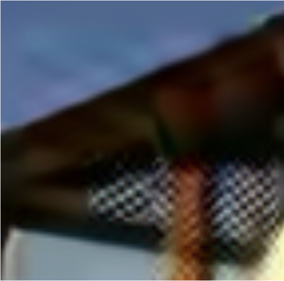
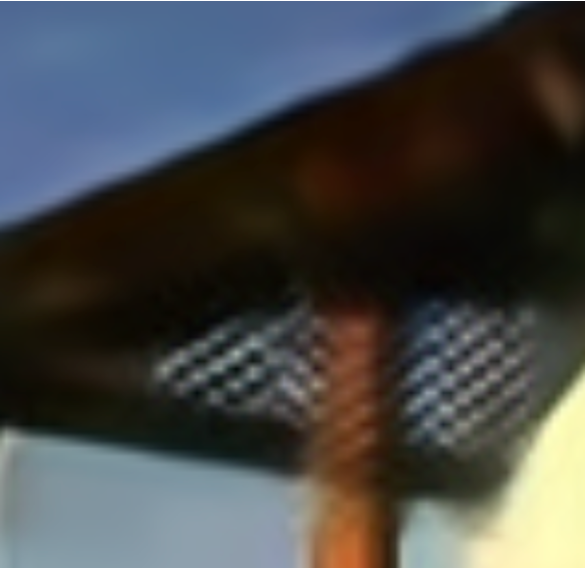

# CNN Image Quality Enhancement (QECNN)

> Academic project · ITMO University · Information Theory and Coding course

Post-compression quality enhancement for HEVC-encoded images using a dual-branch residual CNN. Baseline follows [Yang et al., 2019]; the modified version adds cross-branch feature fusion to improve PSNR.

## Problem

Lossy codecs (x265, QP=35) introduce blocking and ringing artifacts. A learned post-filter in the pixel domain partially recovers high-frequency detail without modifying the encoder/decoder.

## Model Architecture

**Baseline (`MODEL_TF.py`):** single-branch 5-layer cascade with PReLU, residual output `x + f(x)`.

**Modified (`MODEL_TORCH.py`):** dual-branch architecture. Both branches run the same 5-stage pipeline (Conv 9×9·128 → 7×7·64 → 3×3·64 → 3×3·64 → 1×1·32, all PReLU). After each stage, Branch A's feature map is concatenated with Branch B's output before the next convolution, so Branch B continuously refines its representation guided by the parallel path. The final outputs of both branches are concatenated, passed through a single 5×5 conv, and added to the input as a residual (`x + f(x)`).

## Results

PSNR on BSD500 validation set (100 frames): **Compressed 24.57 dB → Baseline 24.63 dB → Modified 24.85 dB** (+0.28 dB gain over compressed input).



### Visual comparison (zoomed patches, QP=35)

|  | Original | Compressed | Enhanced |
|--|----------|------------|---------|
| **1** |  |  |  |
| **2** |  |  |  |
| **3** |  |  |  |

## Dataset

**BSD500**: 400 train / 100 test images (480×320 px). Images are converted to YUV 4:2:0, compressed with x265 at QP=35, then decoded to RGB and sliced into 40×40 patches (stride 20, ~100K train patches).

## Training

| | |
|---|---|
| Optimizer | AdamW, lr=3×10⁻⁴ |
| Scheduler | StepLR, step=100 epochs, γ=0.5 |
| Loss | MSE |
| Epochs | 200 (best checkpoint saved at epoch 50) |
| Batch size | 1024 patches |
| Augmentations | D4 flips/rotations (p=0.5), Gaussian noise σ∈[0.1, 0.2] (p=0.2) |

```bash
python QECNNYUV_TORCH_TRAIN.py   # set PrepareDataSetFromYUV=True on first run
```

## Inference

Runs both the TF baseline and the PyTorch model on a test YUV file frame by frame and outputs a PSNR comparison plot:

```bash
python QECNNYUV_INFER.py
```

## Files

| File | Description |
|------|-------------|
| `MODEL_TORCH.py` | Modified dual-branch model + dataset class + PSNR metric |
| `MODEL_TF.py` | Original QECNN baseline (TensorFlow/Keras) |
| `QECNNYUV_TORCH_TRAIN.py` | Training script: YUV→PNG conversion + training loop |
| `QECNNYUV_INFER.py` | Inference and PSNR comparison |
| `YUV_RGB.py` | YUV 4:2:0 ↔ RGB conversion utility |
| `yuvcompression/` | x265 encode/decode scripts |

## References

- [1] [BSDS500 dataset](https://github.com/BIDS/BSDS500)
- [2] R. Yang et al., "Enhancing Quality for HEVC Compressed Videos," *IEEE TCSVT*, 2019. ([pdf](./doc/Enhancing_Quality_for_HEVC_Compressed_Videos.pdf))

**Tech:** PyTorch, TensorFlow/Keras, OpenCV, Albumentations, NumPy
